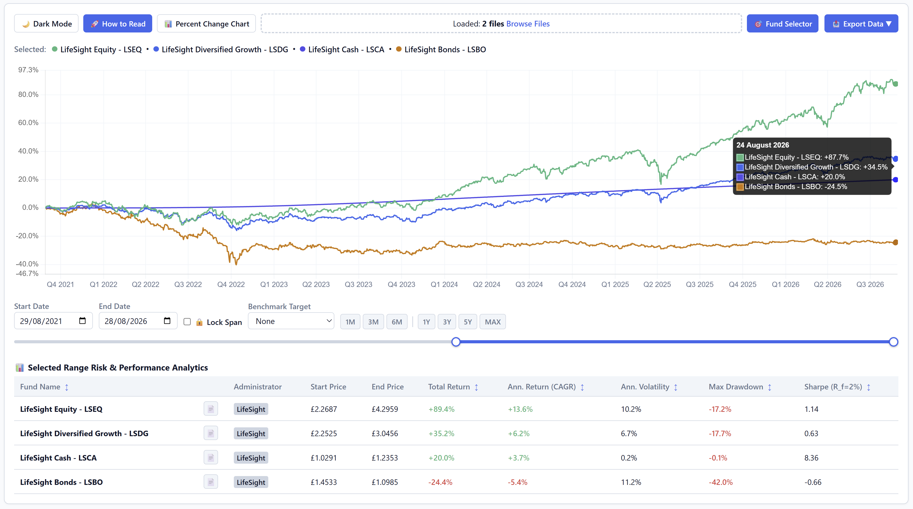
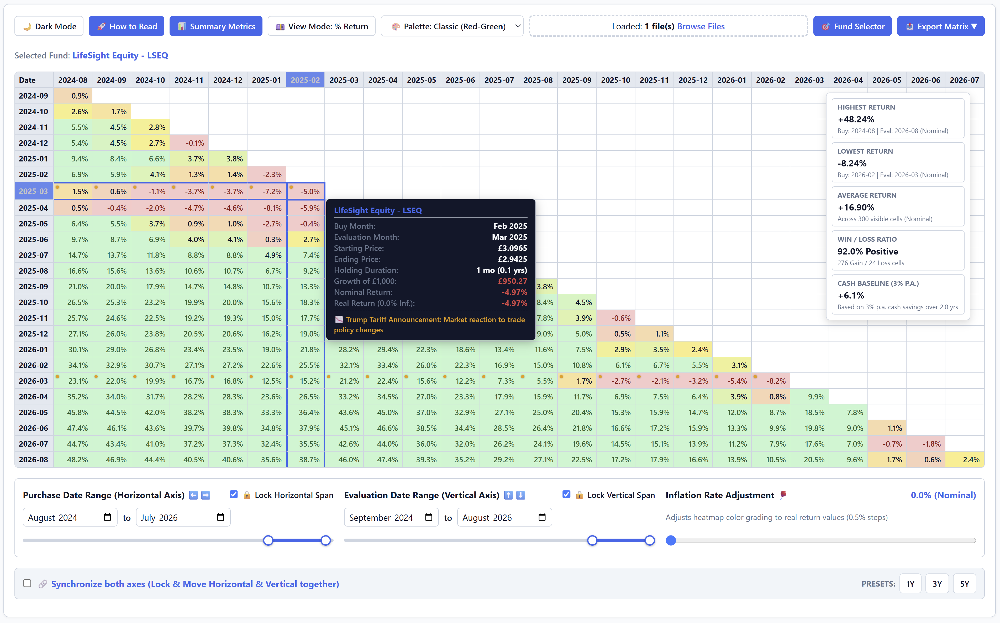

# LifeSight Web Applications: Fund Analytics & Return Matrix

A privacy-focused, zero-setup toolkit designed to analyze unit price trajectories, calculate key investment risk metrics, and visualize multi-year return matrices directly in your browser.

---

## 🌟 Key Features

* **100% Local & Private:** All processing runs locally in browser memory; no data or CSV files are ever uploaded to external servers.
* **Zero Configuration:** No database setup, command-line usage, or external software installation required—runs directly in standard modern web browsers (Chrome, Edge, Firefox, Safari).
* **Customizable Timeframes:** Interactive date sliders, manual date fields, and a "Lock Span" mode that lets you adjust time ranges without altering overall duration.
* **Flexible Exports:** Save visualizations and datasets in CSV, Excel (`.xlsx`), or high-resolution PNG image formats.
* **Modern UI Controls:** Dynamic Light/Dark mode toggles and responsive multi-device support.

---

## 📊 Application Module Comparison

| Feature / Aspect | 📈 Fund Analytics Dashboard | 🧩 Fund Return Matrix |
| :--- | :--- | :--- |
| **Primary Goal** | Trajectory analysis, benchmark performance comparisons, and key risk metrics. | Triangular grid visualizer for return rates based on varying purchase and evaluation dates. |
| **Data Inputs** | Accepts single or multi-CSV files via drag-and-drop or file picker. | load `lifesight_fundprices.csv` (or manual user CSV upload). |
| **Fund Selection** | Multi-fund support via toggles, search bar, and administrator filters. | Single-fund analysis via clickable fund selection tiles. |
| **Visual Views** | Percent Change (%), Unit Price (£), and Target Benchmarks (+2.0% to +13.0% p.a.). | Interactive Heatmap: Green (≥5%), Light Green/Yellow (0%–5%), Red (<0%). |
| **Advanced Tools** | Risk table auto-generating Total Return, CAGR, Volatility, Max Drawdown, and Sharpe Ratio. | Hover tooltips showing holding duration (months), total returns, and cross-axis date sync. |

---

## 🚀 Quick Start Guide

### 📈 Using the Fund Analytics Dashboard

1. **Load Data:** Open in your browser the Dashboard HTML file `lifesight_fundprices.html` and drag your CSV file into the designated drop zone ie `lifesight_fundprices.csv`, or click **Browse Files**.
2. **Configure Display:** Toggle between **Unit Price (£)** or **Percent Change (%)** modes, and optionally select an annual target benchmark line.
3. **Filter Funds:** Use the search bar, filter by Administrator, or click individual fund tiles to display or hide specific funds.
4. **Evaluate Metrics:** Review the automatically generated table below the chart to compare CAGR, Volatility, Max Drawdown, and Sharpe Ratios.
5. **Export Results:** Click **Export Data ▼** to download filtered datasets as CSV/Excel files or export the chart view as a PNG.



### 🧩 Using the Fund Return Matrix

1. **Load Data:** Open in your browser the Return Matrix HTML file `lifesight_fundprices_triangle.html` and drag your CSV file into the designated drop zone ie `lifesight_fundprices.csv`, or click **Browse Files**.
2. **Select Fund:** Click on any individual fund tile to populate the triangular return matrix grid.
3. **Set Parameters:** Adjust the horizontal axis (Purchase Dates) and vertical axis (Evaluation Dates) using the date pickers or range sliders.
4. **Analyze Cells:** Hover over individual matrix cells to view the total months held, purchase price, evaluation price, and overall return percentage.
5. **Export Visuals:** Click **Export Matrix ▼** to output the matrix data as CSV/Excel or capture a PNG snapshot of the heatmap.

* **Calculation Disclaimer:** Matrix calculations use end-of-month unit prices. Actual personal pension returns may vary slightly depending on the exact day of the month your contributions are processed by plan administrators.




---

## ❓ Frequently Asked Questions (FAQ)

**Q: Do I need internet access to use this app?**  
A: Initial load requires internet access to fetch Chart styling libraries via browser CDN. Once loaded, all data processing occurs completely offline inside your browser memory.

**Q: Is my financial data kept safe and private?**  
A: Yes, 100%! All calculations occur entirely within your computer's web browser. None of your data is sent to external servers or cloud services.

**Q: Where can I get updates or report an issue?**  
A: The dashboard is developed and maintained by **Dave Whitehead**. Updates and source code are available at:  
👉 [https://github.com/lakeuk/lifesight-unit-prices](https://github.com/lakeuk/lifesight-unit-prices)

**Q: Can I import csv data from other platforms?**  
A: You can construct your input CSV files according to following format requirements:

### Daily Unit Price CSV 
Option 1 - (`lifesight_fundprices.csv` or `{administrator}_fundprices.csv`)  
Required headers (case-sensitive): `Administrator`, `FundID`, `Fund`, `Date`, `UnitPrice`

```csv
Administrator,FundID,Fund,Date,UnitPrice
LifeSight,101,LifeSight Equity - LSEQ,2016-08-31,1.2534
LifeSight,101,LifeSight Equity - LSEQ,2016-09-01,1.2465
```

Option 2 - (`unit-prices.csv`) note: this is the layout provided by WTW LifeSight  
Required headers (case-sensitive): `Fund Code`, `Fund Name`, `Unit Price Date`, `Currency code`, `Unit Price`

```csv
Fund Code,Fund Name,Unit Price Date,Currency code,Unit Price
LSAM,Annuity Matching,14/08/2026,GBP,1.057
LSAM,Annuity Matching,13/08/2026,GBP,1.0614
```

### Matrix Unit Price CSV 
Option 1 - (`lifesight_fundprices.csv` or `{administrator}_fundprices.csv`)  
Required headers (case-sensitive): `Administrator`, `FundID`, `Fund`, `Date`, `UnitPrice`

```csv
Administrator,FundID,Fund,Date,UnitPrice
LifeSight,101,LifeSight Equity - LSEQ,2016-08-31,1.2534
LifeSight,101,LifeSight Equity - LSEQ,2016-09-01,1.2465
```

Option 2 - (`lifesight_fundprices_triangle.csv`)  
Required headers (case-sensitive): `Administrator`, `FundID`, `Fund`, `PurchaseDate`, `FirstUnitPrice`, `Date`, `UnitPrice`, `PercentChange`

```csv
Administrator,FundID,Fund,PurchaseDate,FirstUnitPrice,Date,UnitPrice,PercentChange
LifeSight,101,LifeSight Equity - LSEQ,2016-08-31,1.2534,2016-09-30,1.2552,0.0014
LifeSight,101,LifeSight Equity - LSEQ,2016-08-31,1.2534,2016-10-31,1.3061,0.042
```
